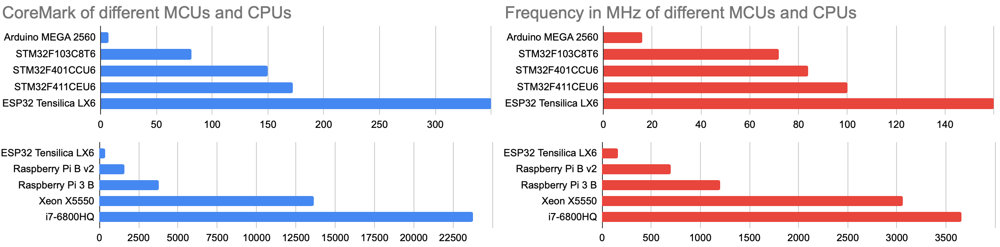

# CoreMark

The initial code was developed in 2009 by [EEMBC](https://github.com/eembc/coremark). Since 2018 it is additionally licenced with the Apache licence.



In 2019 [Paul Stoffregen](https://github.com/PaulStoffregen) from [PJRC](https://www.pjrc.com/) with the [Teensy project](https://www.pjrc.com/teensy/) ported it [to Arduino](https://github.com/PaulStoffregen/CoreMark). It runs out of the box on an ESP32. Multicore optimisation is not enabled yet. In ubuntu it works with

```
make XCFLAGS="-g -DMULTITHREAD=4 -DUSE_FORK=1"
``` 

## Some of my results from Arduino IDE and Ubuntu:

| Board                   | CoreMark | LED | MHz  | Mark/MHz |
| ----------------------- | -------: | :-: | ---: | -------- |
| Arduino MEGA 2560       |        7 |  13 |   16 |     0.44 |
| STM32F103C8T6 128k      |       81 |  17 |   72 |     1.13 |
| STM32F401CCU6 256k      |      150 |  31 |   84 |     1.79 |
| STM32F411CEU6 512k      |      172 |  31 |  100 |     1.72 |
| T-Koala ESP32           |      351 |   5 |  160 |     2.19 |
| Raspberry Pi Model B v2 |     1574 |     |  700 |     2.25 |
| Raspberry Pi 3 Model B  |     3800 |     | 1200 |     3.17 |
| Amlogic S905W tanix tx3 |     3913 |     | 1200 |     3.26 |
| Raspberry Pi 4 v1.1 4GB |     8257 |     | 1500 |     5.50 |
| Xeon X5550              |    13643 |     | 3060 |     4.46 |
| i5-3320M                |    21245 |     | 3300 |     6.44 |
| i7-4960HQ               |    21326 |     |      |          |
| i7-6820HQ               |    23779 |     | 3660 |     6.61 |

## Multithread results

| Board                   | CoreMark | MHz  | Mark/Mhz |
| ----------------------- | -------: | ---: | -------- |
| RPi3 Model B  4 threads |    15194 | 1200 |     3.16 |
| Amlogic S905W 4 threads |    15393 | 1200 |     3.21 |
| Raspberry 4 with  4 threads |    32880 | 1500 |     5.48 |
| i5-3320M 4 threads      |    53450 | 3300 |     4.05 |
| i7-6820HQ 4 threads     |    96420 | 3660 |     6.70 |
| i7-6820HQ 8 threads     |   118862 | 3660 |     4.13 |
| Xeon X5550 16 threads   |   124634 | 3060 |     2.55 |


Bluepill STM32F103C8T6 only with ST-Link V2 programmer.

Blackpill STM32F401CCU6 and STM32F411CEU6 working with:
- Correct board and board part number
- U(S)ART support: "Enabled (generic 'Serial')"
- USB support (if available): "CDC (generic 'Serial' supersede U(S)ART)" to have COM port serial after reboot
- Upload method: "STM32CubeProgrammer (DFU)"

Programming mode activated by press and hold Boot0 and hit NRST. You have a new USB devices "STM32 BOOTLOADER".

Most interesting is the ratio CoreMark/MHz:


## ESP IDF crosscompiling toolchain

The Arduino port from Paul Stoffregen does not run on ESP8266 yet. But [ochrin](https://github.com/ochrin/coremark) used the esp8266 toolchain and got some results in March 2020. I tried to replicate his results:

| Board            | CoreMark | Ochrin |
| ---------------- | -------: | -----: |
| ESP8266   80 MHz |      155 |    191 |
| ESP8266  160 MHz |      262 |        |
| ESP32     80 MHz |          |    166 |
| ESP32    160 MHz |          |    332 |
| ESP32    240 MHz |          |    498 |
| ESP32 2C 160 MHz |          |    661 |
| ESP32 2C 240 MHz |          |    991 |

Still no match for the 2314 coremark score of the Teensy 4.0 (Cortex-M7 at 600 MHz compared to LX6 with 240 MHz). I can't make the ESP32 toolchain running.

