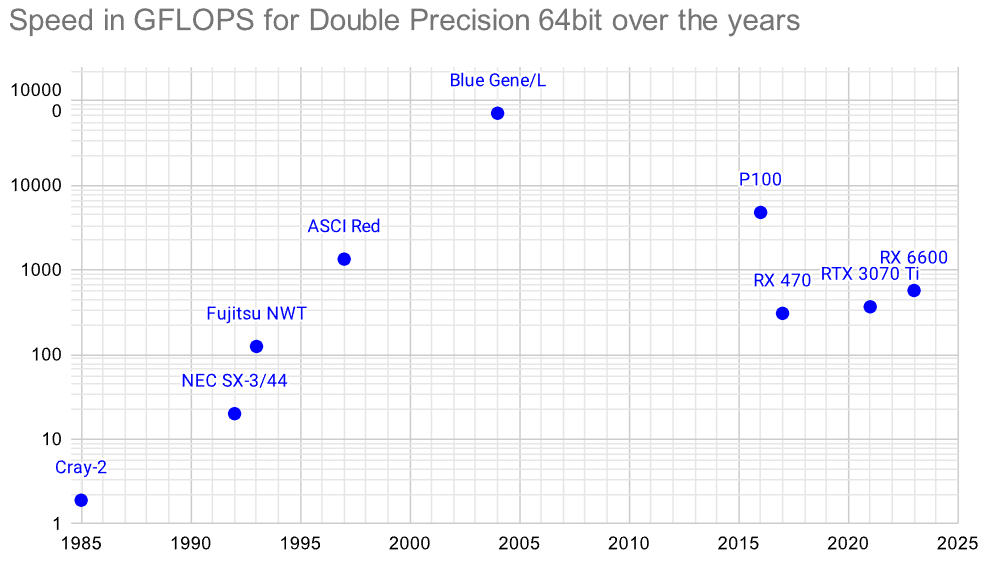

# Linpack benchmark in DP (double precision, 64bit)

When the initial linpack was released in 1979 minicomputers like the [PDP-11](https://en.wikipedia.org/wiki/PDP-11) (from 1970) had just moved from 16bit to 32bit with superminicomputers like the [VAX-11](https://en.wikipedia.org/wiki/VAX-11) (1978). The supercomputer [Cray-1](https://en.wikipedia.org/wiki/Cray-1) uses 64bit for data since 1975. By the time the [TOP500](https://en.wikipedia.org/wiki/TOP500) of fastest supercomputers was created in 1993 most supercomputers were using 64bit. For comparison this value is been used ever since.

64bit for normal citizens took a little longer. In 2003 AMD starts shipping the [Athlon 64](https://en.wikipedia.org/wiki/Athlon_64) processor lines with the first x86-based 64-bit processor architecture. For smartphones to move to 64bit it took until 2013 with the [iPhone 5S](https://en.wikipedia.org/wiki/IPhone_5s).

- [Phoronix Test Suite](#test-with-the-phoronix-test-suite)
- [Fast test precompiled for Windows](#speed-comparison-on-windows)
- Install [HPLinpack 2.3 on Ubuntu](#install-hplinpack-23-on-ubuntu)
- [Paper from ICIST 2017 results](#paper-from-icist-2017-with-results)
- [HPL by Intel](#hpl-by-intel)

## Test with the Phoronix Test Suite


It can be installed in WSL or Ubuntu with:

``` sh
sudo apt install php php-cli php-xml
git clone https://github.com/phoronix-test-suite/phoronix-test-suite/
cd phoronix-test-suite
sudo ./install-sh
phoronix-test-suite benchmark hpl
```


Some of my results are uploaded to [openbenchmarking.org](https://openbenchmarking.org/user/saiht).

|      Machine      |     CPU    |  MHz |      FLOPS      | Cores | architecture |
|:------------------|:----------:|-----:|----------------:|------:| ------------ |
| Arduino Uno R3    | ATmega328P |   16 |          94,300 |     1 | [8-bit AVR RISC](https://en.wikipedia.org/wiki/ATmega328) - [350nm](https://en.wikipedia.org/wiki/350_nm_process), 1997 |
| Jetson Nano A02 🟢| Tegra X1   | 1500 |   3,848,500,000 |     4 | [Cortex-A57](https://en.wikipedia.org/wiki/ARM_Cortex-A57) - 20nm, 2019|
| [Raspberry Pi 4](https://openbenchmarking.org/result/2505036-SAIH-PI4726352)    | BCM2711B0  | 1500 |   5,342,200,000 |     4 | [Cortex-A72](https://en.wikipedia.org/wiki/ARM_Cortex-A72) - 40nm, 2019 |
| Elitebook hp8460p 🔵| i5-2520M | 3200 |  37,275,300,000 |     2 | [Sandy Bridge](https://en.wikipedia.org/wiki/Sandy_Bridge) - 32nm, 2011|
| hp zBook 15 G3 🔵 | i7-6820HQ  | 3600 |  99,997,800,000 |     4 | [Skylake](https://en.wikipedia.org/wiki/Skylake_(microarchitecture)) - 14nm, 2015 |
| Xigmatek Gemini 🔵| i3-10100   | 4038 | 132,278,500,000 |     4 | [Comet Lake](https://en.wikipedia.org/wiki/Comet_Lake) - 10nm, 2019 |
| hp mini 400 G9 🔵 | i7-13700T  | 1840 | 235,712,000,000 |    16 | [Raptor Lake](https://en.wikipedia.org/wiki/Raptor_Lake) - 7nm, 2022 |
| hp MT 600 G4   🔴 | RX 6600    | 2044 | 570,000,000,000 |  1792 | [RDNA2](https://en.wikipedia.org/wiki/RDNA_2) - TSMC N7, 2021 |


This number can be measured much faster with **OpenCL**. Some results for CPUs and GPUs are in the [GPU benchmark section](../gpu/opencl/).

In this section I also included a graph for comparison of GFLOPS with DP (fp64) from the fastest supercomputer of their time to consumer hardware a few years later ([source Google Sheet](https://docs.google.com/spreadsheets/d/17QBJVa8wzo4B1aygXrlk0FWpG4UVwWn3Zo5LsfNnlJM/edit?usp=sharing)):


Earlier graph:



## Speed comparison on Windows

With this download [https://www.techpowerup.com/download/linpack-xtreme/](https://www.techpowerup.com/download/linpack-xtreme/) you don't need to follow the longer steps on Ubunto below or install the phoronix test suite (might not work on smaller systems like Raspberry Pi 1). Results:

|     CPU    |  MHz  |      FLOPS       | source | architecture |
| ---------- | ----: | ---------------: | ------ | ------------ |
| ATmega328P |    16 |           94,300 | [paper](https://github.com/kreier/benchmark/blob/main/LinpackDP/paper_ICIST_2017.pdf) | [8-bit AVR RISC](https://en.wikipedia.org/wiki/ATmega328) - [350nm](https://en.wikipedia.org/wiki/350_nm_process), 1997 |
| RPi 3      | 1,200 |     3,381,000,000 | [Roy Longbottom](http://www.roylongbottom.org.uk/Raspberry%20Pi%203B+%2032%20bit%20and%2064%20bit%20Benchmarks%20and%20stress%20tests.htm), [update](https://www.researchgate.net/publication/331983549_Raspberry_Pi_3B_and_3B_High_Performance_Linpack_and_Error_Tests) | [Cortex-A53](https://en.wikipedia.org/wiki/ARM_Cortex-A53)
| RPi 4      | 1,800 |   13,507,000,000 | [Forum RaspberryPi](https://forums.raspberrypi.com//viewtopic.php?f=63&t=276089), [Roy Longbottom](https://www.researchgate.net/publication/334561068_Raspberry_Pi_4B_Stress_Tests_Including_High_Performance_Linpack) | [Cortex-A72](https://en.wikipedia.org/wiki/ARM_Cortex-A72) |
| RPi 5      | 2,400 |   35,169,000,000 | [Quad-core](https://github.com/geerlingguy/sbc-reviews/issues/21) | [Cortex-A76](https://en.wikipedia.org/wiki/ARM_Cortex-A76) |
| i7-6820HQ  | 3,600 |   99,997,800,000 | - | [Skylake](https://en.wikipedia.org/wiki/Skylake_(microarchitecture)) - 14nm, 2015 |
| i3-10100   | 4,038 |  132,278,500,000 | - | [Comet Lake](https://en.wikipedia.org/wiki/Comet_Lake) - 10nm, 2019 |

Downloaded from [https://www.techpowerup.com/download/linpack-xtreme/](https://www.techpowerup.com/download/linpack-xtreme/).

## Install HPLinpack 2.3 on Ubuntu

### 1. Install dependencies

``` sh
sudo apt-get install -y libatlas-base-dev mpich libmpich-dev gfortran
```

### 2. Download HPL

``` sh
cd ~
wget https://www.netlib.org/benchmark/hpl/hpl-2.3.tar.gz
tar -xvzf hpl-2.3.tar.gz
mv hpl-2.3 hpl
```

### 3. Generate HPL template configuration file

``` sh
cd hpl/setup
sh make_generic
cp Make.UNKNOWN ../Make.linux
cd ../
```

### 4. Modify `Make.linux`: Update paths for MPI and ATLAS libraries:

``` sh 
ARCH         = linux
MPinc        = /usr/include/mpich/
MPlib        = /usr/lib/x86_64-linux-gnu/libmpich.so
LAinc        = /usr/include/x86_64-linux-gnu/atlas
```

### 5. Compile HPL

``` sh
make arch=linux -j $(nproc)
```

### 6. Modify `HPL.dat` and run HPL:

``` sh
cd bin/linux
./xhpl
```

Full guide: [Gist by Levi Hope](https://gist.github.com/Levi-Hope/27b9c32cc5c9ded78fff3f155fc7b5ea)


## Paper from ICIST 2017 with results

| Platform        | CPU/MCU     | Architecture                   | MFlops    | DMIPS     | MHz  | RAM kB  |
| --------------- | ----------- | ------------------------------ | --------: | --------: | ---: | ------: |
| Arduino Uno R3  | ATmega328P  | AVR 8bit RISC                  |    0.0943 |        10 |   16 |       2 |
| Embedded Pi     | STM32F103RB | ARM Cortex-M3 (ARMv7-M) 32bit  |     0.552 |        92 |   72 |      20 |
| Node MCU 1.0    | ESP8266     | Tensilica Xtensa LX106 32bit   |     1.207 |       113 |   80 |      64 |
| Node MCU32      | ESP32s      | Tensilica Xtensa LX106 32bit   |     2.805 |       176 |  160 |     520 |
| NUCLEO F746ZG   | STM32F746Z  | ARM Cortex-M7 (ARMv7E-M) 32bit |     3.588 |       763 |  216 |     320 |
| Raspberry Pi 1B | BCM2835     | ARM1176 (v6) 32bit             |     42.00 |       875 |  700 |  512000 |
| Raspberry Pi 2  | BCM2836     | ARM Cortex-A7 (v7-A) 32bit     |    170.92 |      2019 |  900 | 1024000 |
| Raspberry Pi 3  | BCM2837     | ARM Cortex-A53 (v8-A) 32bit    |    180.14 |      3039 | 1200 | 1024000 |
|                 |             |                                | LinpackDP | Dhrystone |      |         |

Read more in [this article - paper ICIST 2017](paper_ICIST_2017.pdf).


## HPL by Intel

The multithread version to measure the performance of supercomputers there is the High Performance Linpack:

- [https://www.netlib.org/benchmark/hpl/](https://www.netlib.org/benchmark/hpl/)

But you can't just download it and make/compile the benchmark and run it. You need MPI, BLAS and VSIPL. A simple solution is to download the compiled binaries from Intel

- [https://software.intel.com/content/www/us/en/develop/articles/intel-mkl-benchmarks-suite.html](https://software.intel.com/content/www/us/en/develop/articles/intel-mkl-benchmarks-suite.html)

For my i7-6820HQ it reached a maximum of 99.9978 GFlops for a size of 27000. That's $10^{11}$.
