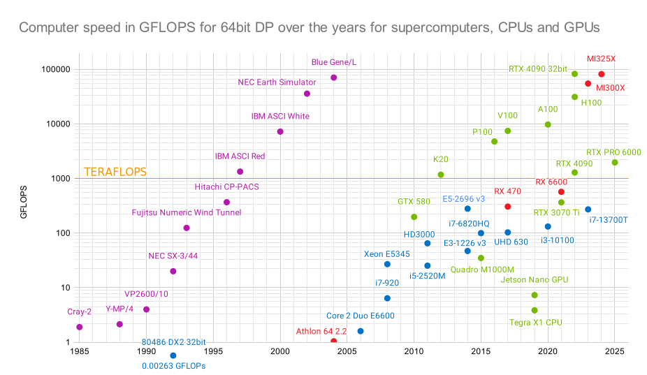
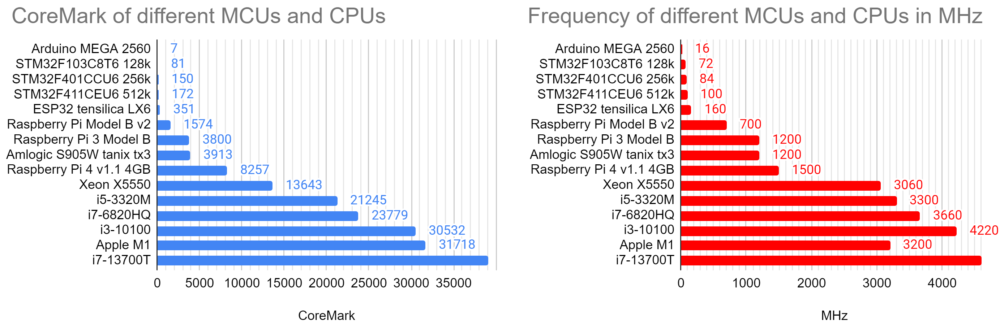
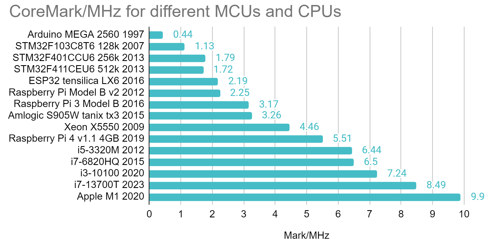
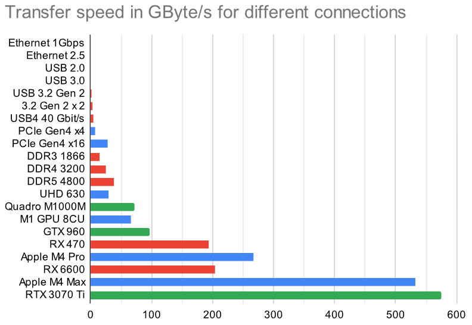

# Benchmark collection

There are countless [benchmarks](https://en.wikipedia.org/wiki/Benchmark_(computing)) out there. This here is just an overview of benchmarks and their results I used over the years. 

- [Whetstone](whetstone) - 1972
- [Linpack](LinpackDP) DP, double precision or fp64 - 1979
- [Dhrystone](dhrystone) - 1984
- [nbench](nbench) - 1996
- [Memtest86+](memtest) - 1986
- [CoreMark](CoreMark) - 2009
- [GPU](gpu) with [gpu/OpenCL](gpu/opencl) and [gpu/fluidX3D](gpu/fluidX3D) by [ProjectPhysX](https://github.com/ProjectPhysX)
- [GeekBench](geekbench)
- [3Dmark](3Dmark)
- [NVMe](nvm) with CrystalDiskMark and hdtune - 2007
- [Webbrowser ](browserbench) - 2010

Some benchmarks were created back in 1972. I measured the speed of a Lattice C compiler against Omicron Basic on my [Atari ST](https://en.wikipedia.org/wiki/Atari_ST) in 1992. The data collection presented here started in 2007 with Memtest86+ and the website http://saiht.de/computer/benchmark.html .

## [Whetstone](whetstone) - 1972

This [synthetic benchmark from 1972](https://en.wikipedia.org/wiki/Whetstone_(benchmark)) is one of the oldest ones to estimate the [FLOPS - floating point operations](https://en.wikipedia.org/wiki/FLOPS) a CPU can perform per second. Well described in an [article of arstechnica](https://arstechnica.com/information-technology/2013/05/native-level-performance-on-the-web-a-brief-examination-of-asm-js/2/) from 2013. And it is neither related to wet nor a [whetstone](https://en.wikipedia.org/wiki/Sharpening_stone), but the town of [Whetstone](https://en.wikipedia.org/wiki/Whetstone,_Leicestershire) in England.

## [Linpack](LinpackDP) DP - FLOPS since 1979

This is older than Linux and not related, **Lin** is short for linear Algebra, today heavily used in parallel computing with BLAS - Basic Linear Algebra Subprograms. This benchmark from 1979 is well described at [Wikipedia](https://en.wikipedia.org/wiki/LINPACK_benchmarks). It is still usefull today because it scales with IPC (instructions per cycle), frequency and most importantly **number of cores**. It is therefore used since 1993 to determine the speed of supercomputers with a single value to put it in a list for comparison as the [TOP500](https://en.wikipedia.org/wiki/TOP500). It is measured in FLOPS in DP (double precision, 64bit). For LLMs we don't need that much precision, but can compare it partly in modern GPUs and GPGPUs, for example with OpenCL. More further down in the GPU section.

## [Dhrystone](dhrystone) - 1984

If whet (wet) is for floating point operations, then dhry (dry) is for integer performance. This led to the [Dhrystone benchmark](https://en.wikipedia.org/wiki/Dhrystone) in 1984. Gave it a try as well. 

## [NBench](nbench) - 1996

[This benchmark (Wikipedia)](https://en.wikipedia.org/wiki/NBench) form the mid 1990s runs on a variety of hardware and has been maintained [until 2012](http://www.math.utah.edu/~mayer/linux/bmark.html) by Uwe F. Mayer. For modern computers it is rather lightwight and can be compiled on a simple linux machine with gcc in merely seconds, then run for some minutes. I collect data for this benchmark since 2006.

## [Memtest 86+](memtest86) - 1986

The data gives some inside to the architechture of the CPU and the speed of the connected memory.

## [CoreMark](CoreMark) - 2009 for embedded systems

Intended for embedded systems by [EEMBC](https://github.com/eembc/coremark) in 2009 for embedded system it is too large for an Arduino Uno, but runs from an Arduino Mega 2560 onwards to multithreaded Octacore Xeon processor. The results show that it scales mostly with frequency and a little with improved IPC.

The results vary from some 7 points for the Arduino Mega 2560 (the Leonardo and Uno have not enough RAM) to 39082 for an i7-13700T or 390614 in a 24-thread execution. That's 5580x or 55802x faster, almost 5 magnitudes! That's hard to display with linear bar graphs. The range of frequencies is vast as well from 16 MHz in the Arduino to 4600 MHz in a Quadcore i7, another 280x. Putting these two values (CoreMark and Frequency) into relationship narrows the differences:

It is still comparing an old 8bit CPUs with a modern 32bit ARM and 64bit x86 CPUs, with long pipelines, many registers and large caches. The difference in simple IPC is seen.

## [embench](embench) - 2019 for RISC-V comparison

When [comparing the power](https://content.riscv.org/wp-content/uploads/2019/06/9.25-Embench-RISC-V-Workshop-Patterson-v3.pdf) of the new [RISC-V](https://en.wikipedia.org/wiki/RISC-V) ISA some people used drystone and coremark on May 12th, 2018. Not everybody was happy. While 4.9 CoreMarks/MHz and 2.5 DMIPS/Mhz sound interesting, there are shortcomings. To provide a proper tool for comparison they developed this suite from 2019 on. Version 0.5 was released  in June 2020 at the Embedded World Conference in Nürnberg, Germany.

## [3Dmark](3Dmark) - since 1999 for 3D graphics cards

Testing the speed of a 3D graphics card is inherent to its purpose of presenting a smooth image for the user. The benchmark from 1999 still runs on modern hardware. I longed for years to eventually have the hardware just to see the benchmark without stutter. Instead of investing in expensive hardware I relied on Moore's law and waited. Endurance payed off!

## [GeekBench](geekbench) 2007, 2019 (5.0)

Some collected values from version 2 to 5 and compared in a table.

## [Crystaldisk and hdtune for non volatile memory](nvm) - 2007

Evolved speed of non volatile memory NVM over the years. Compare my Samsung R20 from 2008 with mechanical harddrive to my Lenovo Yoga 370 from 2017 with NVMe:

## [Webbrowser benchmarks](browserbench) - 2010+

The benchmarks drove the innovation in browser development significantly, but became obsolete quite fast as well. Notable examples are Browermark 2.0, Basemark Web 3.0, peacekeeper, octane, sunspider, kraken, Jetstream and Speedometer.

## [GPU](gpu) performance

With image classification using GPUs in AlexNet 2012 people saw the potential of GPUs for machine learning. And in 2022 the whole world payed attention with ChatGPT. The performance today is comparable with Supercomputers of the late 90s of the last century:

<!-->

-->

A limiting factor for these LLMs is often the memory speed, not just processing power in GFLOPS. Here is how some of them compare to other ways of information transfer like Ethernet, DDR3 and USB4.

The speed differences are so vast I had to include a logarithmic graph. This visualizes the magnitudes of differences between the solutions.

## SuperPi 1M

Calcualting Pi to 1 million digits does not take too long nowadayes:

## Prime numbers in basic, python and CPU

One of my first benchmarks, written 1992 in Omicron Basic on the Atari ST 520 STFM and then compared to an edition in Lattice C. Surprisingly the Basic variant was faster.

With text output in Mu it took the ESP32-S2 38.9 seconds. Commenting the print command in line 17 reduced the time to 13.3 seconds.

I used it for some microcomputers as well:

| Frequency |  ESP8266 |   ESP32  | Raspberry Pi 1 | Raspberry Pi 4 |
|:---------:|:--------:|:--------:|:--------------:|:--------------:|
|    40 MHz |     -    | 44427 ms |                |                |
|    80 MHz | 32807 ms | 23323 ms |                |                |
|   160 MHz | 16113 ms | 11375 ms |                |                |
|   240 MHz |     -    |  7783 ms |                |                |

## [Toy Benchmark Programs](to-benchmark-programs)

Ideas are taken from: 

### [Benchmark game](https://benchmarksgame-team.pages.debian.net/benchmarksgame/) - Which programming language is the fastest?

Compiled in 2018 (with history going back to 2002) several benchmarks compare the execution speed of programs in 24 languages. Many are optimized for multicore parallel execution, to make modern processors comparable. Probably disable the efficiency cores might speed up the processes.
