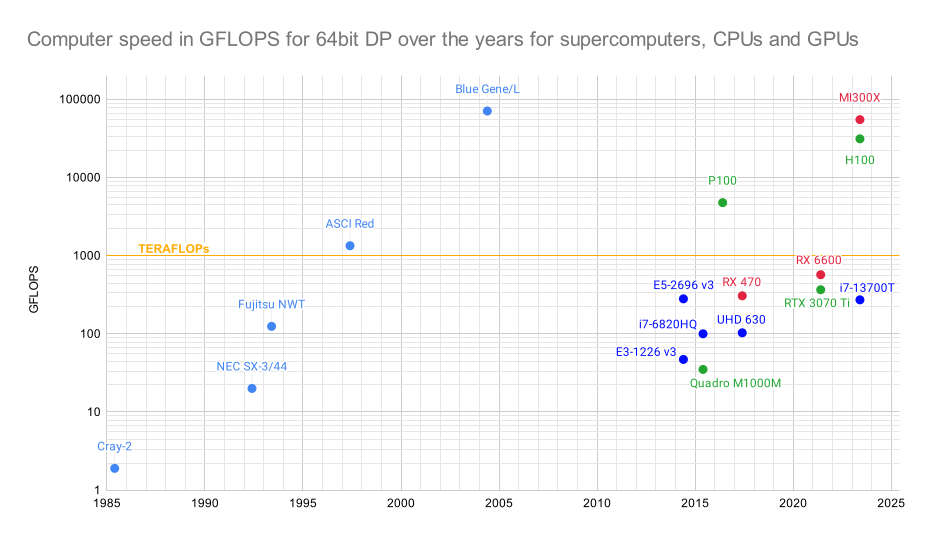
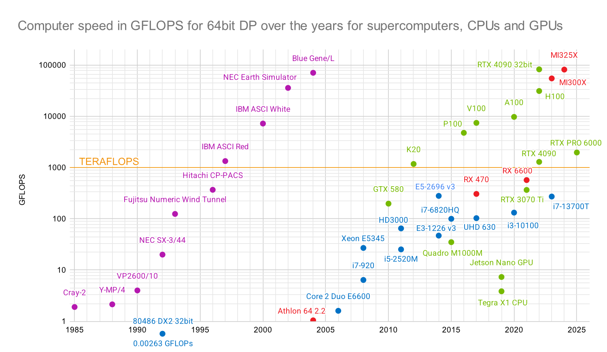

# Images and documents for my benchmark collection

## GFLOPS comparison over time

Growing up with the Cray-2 as the fastest supercomputer with more than 1 GFLOPS this remained the case almost until I finished high school in 1992. By then our new 80486 SX at school had merely 1 MFLOPS, 1000x slower and 7 years later. Consumer hardware only got to this speed in 2004 with the Athlon64, about 20 years later. Still impressive! See at these graphs:

Origin of this graph: This [Google Sheet](https://docs.google.com/spreadsheets/d/17QBJVa8wzo4B1aygXrlk0FWpG4UVwWn3Zo5LsfNnlJM/edit?usp=sharing) with some edits.
