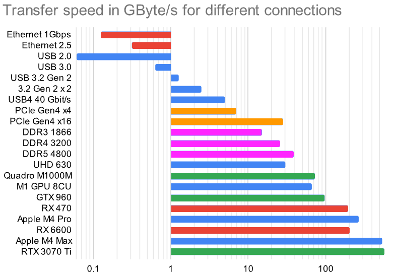
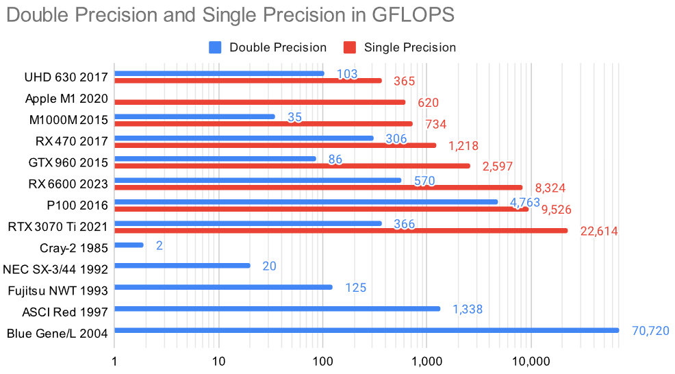
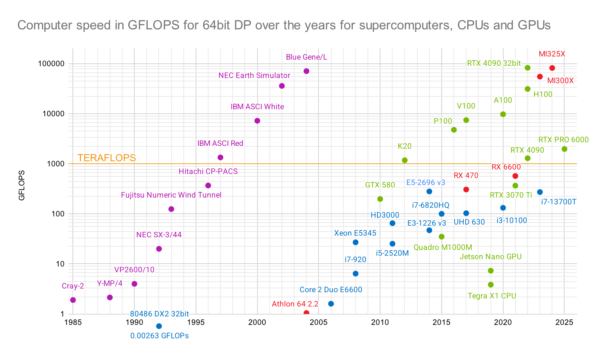

# GPU performance in GFLOPS

With OpenCL we can not only test the GPU, but also the CPU. Here is a little substructure:

- [OpenCL](./opencl/)
- [Fluid3D](./fluidX3D/)

On the way to a [GPGPU](https://en.wikipedia.org/wiki/General-purpose_computing_on_graphics_processing_units) and to compare the processing speed I tried to collect some theoretical GFLOPS data as well as measuring the computation speed in half-precision, single and double precision (FP16, FP32 and FP64) with OpenCL. In the near future some TOPS with INT8 for NPUs and __bf16__ numbers for GPUs will be interesting with tne new wave of AI and LLMs. 


Origin of this graph above: This [Google Sheet](https://docs.google.com/spreadsheets/d/17QBJVa8wzo4B1aygXrlk0FWpG4UVwWn3Zo5LsfNnlJM/edit?usp=sharing) with some edits.


In many cases the limiting factor for the performance of an LLM is not the sheer processing power of the CPU or GPU, but the bandwidth to access the memory. And the whole model has to fit into the RAM! This limits the size on many consumer GPUs, or makes it expensive to run these models. Fast memory is expensive. I compared the speed of a few links to memory from DDR3 over Ethernet and USB4 with the memory bus of some of my graphics cards:

 

The difference spans several magnitudes, so I included a logarithmic graph to the right. Even DDR5 with dual channel is no match for GDDR6X RAM or even HBM (high bandwidth memory).

And one can see how much computing power today is available to the average consumer if you compare it to the processing power of supercomputers of the last millenia:

 

## Benchmark with OpenCL

Using the [OpenCL-Benchmark tool](https://github.com/ProjectPhysX/OpenCL-Benchmark) by Dr. Moritz Lehmann I measured several CPUs and GPUs for their performance in floating point from half to double, and integer values.

| Device           | FP64<br>double | FP32<br>single | FP16<br>half | INT64<br>long | INT32<br>int | INT16<br>short | INT8<br>char |
|------------------|:--------:|---------:|---------:|:-------:|:-------:|:-------:|:-------:|
| units            | TFLOPs/s | TFLOPs/s | TFLOPs/s | TIOPs/s | TIOPs/s | TIOPs/s | TIOPs/s |
| i5 3320M         |   0.000  |   0.000  |   ---    |  0.003  |  0.016  |  0.032  |  0.018  |
| E3-1226 v3       |   0.047  |   0.046  |   ---    |  0.013  |  0.021  |  0.005  |  0.011  |
| i7-6820HQ        |   0.100  |   0.098  |   ---    |  0.029  |  0.038  |  0.142  |  0.159  |
| i3-10100         |   0.119  |   0.138  |   ---    |  0.041  |  0.053  |  0.197  |  0.217  |
| i7-8700          |   0.201  |   0.197  |   ---    |  0.059  |  0.076  |  0.279  |  0.300  |
| i7-13700T        |   0.272  |   0.220  |   0.054  |  0.071  |  0.127  |  0.397  |  0.406  |
| E5-2696 v3       |   0.280  |   0.281  |   0.076  |  0.058  |  0.125  |  0.478  |  0.514  |
| 🔵 HD Gen11      |    ---   |   0.182  |   0.333  |  0.008  |  0.030  |  0.361  |  0.063  |
| 🔵 UHD 620       |   0.097  |   0.365  |   0.659  |  0.013  |  0.115  |  0.642  |  0.129  |
| 🔵 UHD 630       |   0.102  |   0.395  |   0.722  |  0.015  |  0.135  |  0.782  |  0.136  |
| 🔵 UHD 770       |    ---   |   0.700  |   1.292  |  0.060  |  0.252  |  2.838  |  2.881  |
| 🟢 Quadro M1000M |   0.035  |   0.734  |   ---    |  0.192  |  0.308  |  1.071  |  1.087  |
| ⚪ M1 GPU 8CU    |    ---   |   0.620  |   ---    |  0.439  |  0.603  |  0.645  |  0.638  |
| 🟢 GTX 960       |   0.086  |   2.597  |   ---    |  0.551  |  0.918  |  2.649  |  2.652  |
| 🔴 RX 470        |   0.306  |   1.218  |   4.749  |  0.686  |  0.985  |  1.920  |  1.914  |
| 🟢 P106-100      |   0.151  |   4.526  |   0.076  |  0.859  |  1.512  |  4.542  | 16.395  |
| 🟢 GTX 1060      |   0.149  |   4.466  |   0.075  |  0.821  |  1.435  |  4.465  |  4.496  |
| 🟢 GTX 1070      |   0.225  |   6.710  |   0.113  |  1.254  |  2.182  |  6.549  | 23.718  |
| 🟢 P104-100      |   0.223  |   6.657  |   0.111  |  1.439  |  2.239  |  6.673  | 24.380  |
| 🔴 RX 6600       |   0.570  |   8.324  |  16.641  |  0.466  |  1.845  |  7.498  |  5.564  |
| 🟢 T4            |   0.250  |   8.092  |   ---    |  1.939  |  6.326  |  5.257  |  5.279  |
| 🟢 RTX 3060 Ti   |   0.287  |  17.748  |  18.291  |  2.799  |  9.228  |  8.062  |  6.844  |
| 🟢 RTX 3070 Ti   |   0.369  |  22.572  |  23.276  |  3.049  | 11.721  | 10.198  | 43.704  |

We also get some further details on the hardware:

| Device           | OpenCL | CU | Freq. | Cores | TFLOPs/s | Memory |  PCIe |
|------------------|:------:|---:|------:|------:|---------:|-------:|------:|
| units            | version | # |   MHz |   # | theorerical | GB/s  |  GB/s |
| i5 3320M         |   1.2  |  4 |  2600 |     2 |    0.166 |  27.65 |  6.93 |
| E3-1226 v3       |   1.2  |  4 |  3300 |     2 |    0.211 |  22.11 |  8.73 |
| i7-6820HQ        |   3.0  |  8 |  2700 |     4 |    0.346 |  32.57 | 11.92 |
| i3-10100         |   3.0  |  8 |  3600 |     4 |    0.461 |  35.49 | 13.66 |
| i7-8700          |   3.0  | 12 |  3200 |     6 |    0.614 |  34.66 | 13.03 |
| i7-13700T        |   3.0  | 24 |  2400 |    16 |    0.000 |  42.55 | 18.39 |
| E5-2696 v3       |   3.0  | 36 |  2300 |    18 |    1.325 |   8.27 |  1.56 |
| 🔵 HD Gen 11     |   1.2  | 16 |   750 |   128 |    0.192 |  16.13 |  6.26 |
| 🔵 UHD 620       |   3.0  | 24 |  1100 |   192 |    0.422 |  14.47 |  6.28 |
| 🔵 UHD 630       |   3.0  | 23 |  1100 |   184 |    0.405 |  29.89 | 15.30 |
| 🔵 UHD 770       |   3.0  | 32 |  1600 |   256 |    0.819 |  45.25 | 20.12 |
| 🟢 Quadro M1000M |   1.2  |  2 |  1071 |   512 |    1.097 |  71.74 |  6.35 |
| ⚪ M1 GPU 8CU    |   1.2  |  8 |  1000 |  1024 |    2.048 |  65.54 | 18.28 |
| 🟢 GTX 960       |   1.2  |  8 |  1266 |  1024 |    2.593 |  97.41 |  6.91 |
| 🔴 RX 470        |   2.0  | 32 |  1226 |  2048 |    5.022 | 193.25 |  6.40 |
| 🟢 P106-100      |   3.0  | 10 |  1708 |  1280 |    4.372 | 175.52 |  3.33 |
| 🟢 GTX 1060      |   1.2  | 10 |  1708 |  1280 |    4.372 | 162.14 |  6.95 |
| 🟢 GTX 1070      |   3.0  | 15 |  1683 |  1920 |    6.463 | 220.41 |  3.24 |
| 🟢 P104-100      |   3.0  | 15 |  1733 |  1920 |    6.655 | 314.02 |  0.84 |
| 🔴 RX 6600       |   2.0  | 16 |  2044 |  1792 |    7.326 | 204.61 |  4.57 |
| 🟢 T4            |   1.2  | 40 |  1590 |  2560 |    8.141 | 245.42 |  4.74 |
| 🟢 RTX 3060 Ti   |   1.2  | 38 |  1665 |  4864 |   16.197 | 423.68 |  9.83 |
| 🟢 RTX 3070 Ti   |   3.0  | 48 |  1770 |  6144 |   21.750 | 574.81 |  8.76 |

Example output:

```
.-----------------------------------------------------------------------------.
| Device ID      | 0                                                          |
| Device Name    | Tesla T4                                                   |
| Device Vendor  | NVIDIA Corporation                                         |
| Device Driver  | 535.104.05 (Linux)                                         |
| OpenCL Version | OpenCL C 1.2                                               |
| Compute Units  | 40 at 1590 MHz (2560 cores, 8.141 TFLOPs/s)                |
| Memory, Cache  | 15102 MB, 1280 KB global / 48 KB local                     |
| Buffer Limits  | 3775 MB global, 64 KB constant                             |
|----------------'------------------------------------------------------------|
| Info: OpenCL C code successfully compiled.                                  |
| FP64  compute                                         0.250 TFLOPs/s (1/32) |
| FP32  compute                                         8.092 TFLOPs/s ( 1x ) |
| FP16  compute                                          not supported        |
| INT64 compute                                         1.939  TIOPs/s (1/4 ) |
| INT32 compute                                         6.326  TIOPs/s (2/3 ) |
| INT16 compute                                         5.257  TIOPs/s (2/3 ) |
| INT8  compute                                         5.279  TIOPs/s (2/3 ) |
| Memory Bandwidth ( coalesced read      )                        245.42 GB/s |
| Memory Bandwidth ( coalesced      write)                        215.51 GB/s |
| Memory Bandwidth (misaligned read      )                        260.63 GB/s |
| Memory Bandwidth (misaligned      write)                         84.02 GB/s |
| PCIe   Bandwidth (send                 )                          4.74 GB/s |
| PCIe   Bandwidth (   receive           )                          4.53 GB/s |
| PCIe   Bandwidth (        bidirectional)            (Gen3 x16)    4.13 GB/s |
'-----------------------------------------------------------------------------'
```

Below some text from 2020 when I started to collect some information:

## FP32 single precision

Let's assume this is possible max raw performance in long (32 bit or single) FP32

- PS2			GFLOPS 		16 Pixel shaders
- PS3
- PS4 		1840 GFLOPS		18 CU, 8 GB GDDR5 memory 5500 MT/s
- PS4 Pro	4198 GFLOPS		36 CU, 32 ROPs, 144 TMUs, 2304 Cores, 256 bit bus, 217.6 GB/s
- PS5
- RX 470 	3793 GFLOPS
- Apple M1 	2600 GFLOPS (8-core, 128 CU or execution units, handle nearly 25,000 threads
- XBOX 360
- Xbos one S 
- XBox Series S 
- XBox Series X 

In many cases it can be simple calculated by the CPU architecture and the frequency. For example my dual [Xeon X5550](https://ark.intel.com/content/www/us/en/ark/products/37106/intel-xeon-processor-x5550-8m-cache-2-66-ghz-6-40-gt-s-intel-qpi.html) with 2.67 GHz has a [multiplier of 8](https://en.wikipedia.org/wiki/FLOPS) (Nehalem EP) which results in 2.67 x 8 = 21.36 gflops.

## FP64 double precision

This is a tricky one. In the 20th century this was the unit for scientific calculations and models, used for weather forecast or earth simulations. I guess it originates with the FE (finite elements) approach to model nature. The more parameters and details in the model, the more granularity you get and the better it represents reality. The flipside: it needs exponentially more computing power. That's why the number of FLoating Point OPerations per Second (FLOPS) became a unit of measurement for the speed of a Supercomputer. And the precision used as double precision with fp64 was merely implied.

Having less bits per element saves storage, let's transport more data per cycle and is also faster to compute. The very compute units are getting smaller too. And in the early 2000s we started to use neural networks. Initially the nodes and parameters were stored in fp64, but the precision was not needed. The move to fp32 was swift, twice the data can be analyzed, hardware simplified. Google created the first NPU (Neural Processing Units) and realized that fp32 is still too much. But fp16 does not have the needed orders of magnitude. Realizing that magnitude (the exponent in floating point numbers) is more important than the significant digits (mantisse) a new format for floating points was introduced: bf16 (brain float) that uses the same number of bits for the exponent like bf32, but reduces the precision to fit into just 16 bit. Again halved.

Then came the transformer models, and the Generative Pretrained Transfomers (GPT) from 1.0, 2.0, 3.0 and a special edition of 3.5 in form of ChatGPT. And again it became clear: the more parameters, the better the model. Yet another observation was made: The precision could be further reduced! The original bf16 or fp16 weights cold be reduced to int8 or less, maybe int4? The quantizied models from bf16 to int8 were now 4x smaller and fit in some consumer graphics cards. Processing or evaluation (EV) after prompt processing (PP) is usually only memory bandwidth contrained, so the answer is also generated 4x faster. In comparision generally it's better to have a model with more parameters but quantized fitting into the RAM than having a model with less parameters but full precision or resolution of the weights. What a time! 

And consumer graphics cards are notorius slow in fp64, sometimes a quarter, 1/8 or 1/64 of the fp32 performance. I guess that's intentional, but also not surprizing since its not needed for 3D games.

Examples:

- RX 470 	237 GFLOPS versus 3793 in fp32
- RTX 3060 Ti fp64: 287 versus fp32: 17748, that's 62x slower

CPUs in general show the same performance, since they operate in 64 bit and feeding only 32 bit in OpenCL seems not to execute two operations in parallel.
