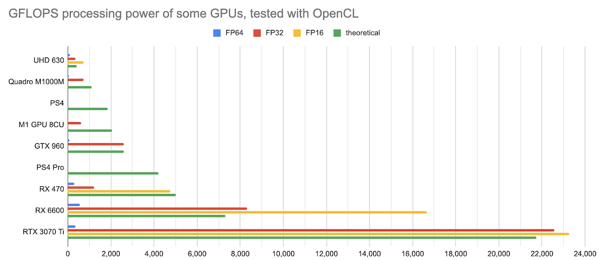

# GPU performance in GFLOPS

On the way to a [GPGPU](https://en.wikipedia.org/wiki/General-purpose_computing_on_graphics_processing_units) and to compare the processing speed I tried to collect some theoretical GFLOPS data as well as measuring the computation speed in half-precision, single and double precision (FP16, FP32 and FP64) with OpenCL. In the near future some TOPS with INT8 for NPUs and __bf16__ numbers for GPUs will be interesting with tne new wave of AI and LLMs. 

Below some text from 2020 when I started to collect some information:

## FP32 single precision

Let's assume this is possible max raw performance in long (32 bit or single) FP32

- PS2			GFLOPS 		16 Pixel shaders
- PS3
- PS4 		1840 GFLOPS		18 CU, 8 GB GDDR5 memory 5500 MT/s
- PS4 Pro	4198 GFLOPS		36 CU, 32 ROPs, 144 TMUs, 2304 Cores, 256 bit bus, 217.6 GB/s
- PS5
- RX 470 	3793 GFLOPS
- Apple M1 	2600 GFLOPS (8-core, 128 CU or execution units, handle nearly 25,000 threads
- XBOX 360
- Xbos one S 
- XBox Series S 
- XBox Series X 

In many cases it can be simple calculated by the CPU architecture and the frequency. For example my dual [Xeon X5550](https://ark.intel.com/content/www/us/en/ark/products/37106/intel-xeon-processor-x5550-8m-cache-2-66-ghz-6-40-gt-s-intel-qpi.html) with 2.67 GHz has a [multiplier of 8](https://en.wikipedia.org/wiki/FLOPS) (Nehalem EP) which results in 2.67 x 8 = 21.36 gflops.

## FP64 double precision

- RX 470 	237 GFLOPS
