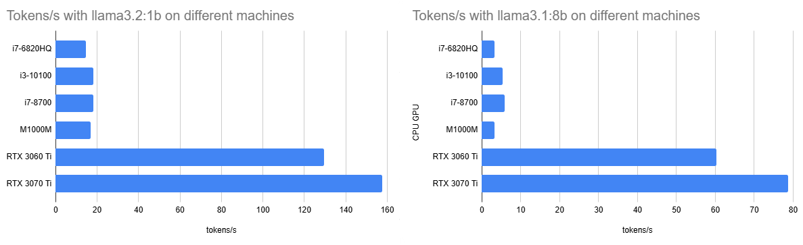
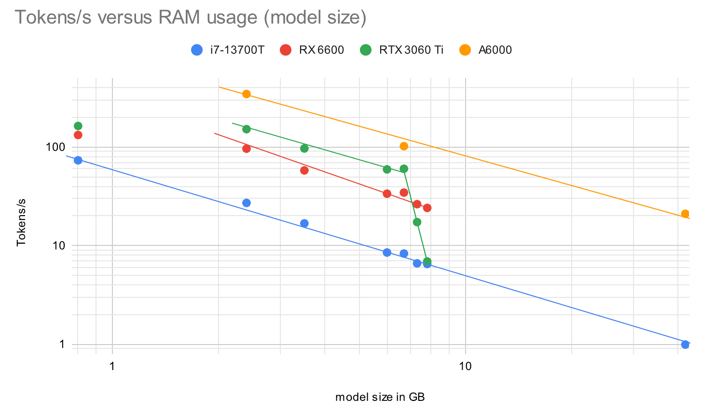
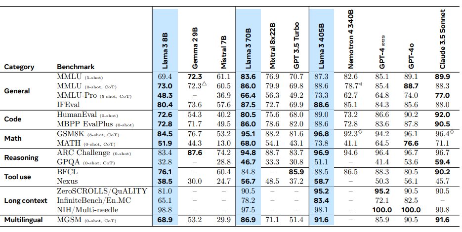

# LLM Large Language models

## Ollama

While the training is probably out of the scope of a hobbyist to get meaningful results running inference can be done with a CPU and just 2 GB of RAM dedicated to a small LLM. More RAM fit larger models and give more extensive results, but also need more computing power. A parallelized GPU on the other hand can speed up the generation process of a GPT (generative pre-trained transformer). So I tried different sizes on different sets of hardware.

The reference inference task after `ollama run --verbose llama3.2:1b` is `explain quantum entanglement`.

Interestingly the 1.3B model llama3.2:1b actually consumes 2.7 GB for the 100% GPU on my 3070 Ti, while the llama3.1:latest should only be 4.7 GB according to `ollama list` but actually requires 6.7 GB in `ollama ps`. What is the origin of this overhead?

To disable the use of the GPU when generating the answer I set `/set parameter num_gpu 0`. You see the results of `tokens/s` below.

| CPU GPU     | llama3.2:1b | llama3.1:8b | gemma2:9b | qwen2.5:7b |
|-------------|-------------|-------------|-----------|------------|
| i7-6820HQ   | 14.7        | 3.2         |           |            |
| i3-10100    | 18.2        | 5.4         | 3.8       | 6.1        |
| i7-8700     | 18.1        | 5.8         | 4.4       |            |
| M1000M      | 16.8        | 3.3         |           |            |
| RTX 3060 Ti | 129.5       | 60.2        | 17.3      |            |
| RTX 3070 Ti | 157.5       | 78.7        | 15.9      | 77.9       |

The correlation between model size (or a little more used RAM/VRAM) and the output speed tokens/s is visualized in this graph:

Of course larger models are more accurate. Meta measured this metric in serveral benchmarks as well:

With my hardware I try to fit my models in 8GB and probably will use 7b models. Or the new `llama3.2vision:11b`. I should have gone for the 12GB 3060!
