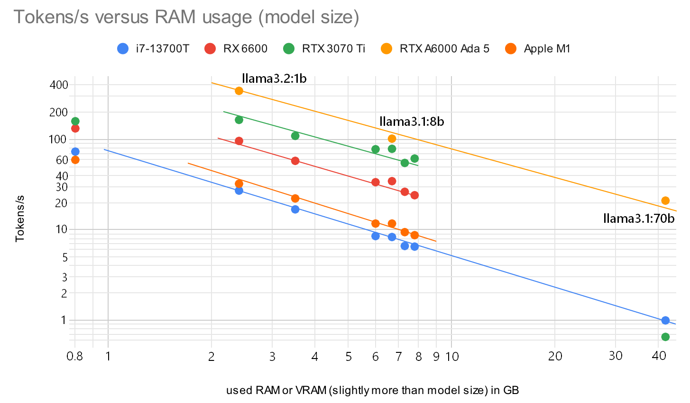

# LLM Large Language models

## Ollama

While the training is probably out of the scope of a hobbyist to get meaningful results running inference can be done with a CPU and just 2 GB of RAM dedicated to a small LLM. More RAM fit larger models and give more extensive results, but also need more computing power. A parallelized GPU on the other hand can speed up the generation process of a GPT (generative pre-trained transformer). So I tried different sizes on different sets of hardware.

The reference inference task after `ollama run --verbose llama3.2:1b` is `explain quantum entanglement`.

Interestingly the 1.3B model llama3.2:1b actually consumes 2.7 GB for the 100% GPU on my 3070 Ti, while the llama3.1:latest should only be 4.7 GB according to `ollama list` but actually requires 6.7 GB in `ollama ps`. What is the origin of this overhead?

To disable the use of the GPU when generating the answer I set `/set parameter num_gpu 0`. You see the results of `tokens/s` below.

|      CPU GPU      | qwen2.5:0.5b | llama3.2:1b | llama3.2:3b | llama3.1:8b | llama3.1:70b |
|:-----------------:|:------------:|:-----------:|:-----------:|:-----------:|:------------:|
| E3-1226 v3        |         36.6 |        13.7 |         9.1 |         4.3 |            - |
| i7-6820HQ         |         41.6 |        16.7 |        10.2 |         4.7 |         0.57 |
| E5-2696 v3        |         43.9 |        17.6 |        10.5 |         4.8 |         0.18 |
| i3-10100          |         39.8 |        19.1 |        11.5 |         5.4 |         0.71 |
| i7-8700           |         54.1 |        20.1 |        12.1 |         5.9 |         0.64 |
| i7-13700T         |         73.3 |        27.1 |        16.8 |         8.3 |         0.99 |
| Ryzen AI 9 HX 370 |              |        37.6 |             |             |              |
| X Elite X1E78100  |              |        51.9 |             |             |              |
| M1000M            |         32.6 |        17.6 |         8.6 |         3.6 |       -      |
| GTX 960           |         68.9 |        18.6 |        10.2 |        4.15 |       -      |
| RX 6600           |        132.4 |        96.2 |        57.9 |        34.5 |       -      |
| RTX 4050 Laptop   |              |        99.4 |             |             |              |
| RTX 3060 Ti       |        163.5 |       151.7 |        96.7 |        60.2 |         0.69 |
| RTX 3070 Ti       |        159.1 |       164.6 |       109.4 |        78.7 |         0.65 |
| RTX A6000 Ada     |              |       345.1 |             |       102.2 |         20.7 |

The correlation between model size (or a little more used RAM/VRAM) and the output speed tokens/s is visualized in this graph:

Of course larger models are more accurate. Meta measured this metric in serveral benchmarks as well:

With my hardware I try to fit my models in 8GB and probably will use 7b models. Or the new `llama3.2vision:11b`. I should have gone for the 12GB 3060!
