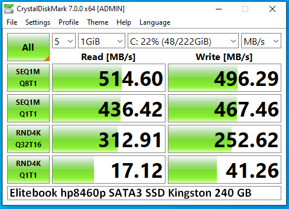

# Historic results for non volative memory (NVM) like HDD, SSD and NVMe

Over the last 10 years the speed of non volatile storage has increased significantly. Let's take for example the hard drive in my Samsung R20 notebook from 2008 with a 120GB SATA2 drive from hitachi. For comparison a NAS drive from Western Digital from 2016, a 3TB SATA3 3.5" drive:


Switching to solid state drives the speed improves even further. The sequential read rate jumped from 30 MByte/s in 2008 to 140 in 8 years later - more than 4 times faster. SATA3 SSDs are limited to 500 MB/s, now 17x faster. In 2020 with NVMe Rev3 x4 on the WD Black you can get 3400 MB/s or 113x faster than 2008 and still 6.8x faster than SATA SSDs.




This change is one of the reasons for responsive Computers in recent years.

## How to measure speed in Linux

You can use the CLI in unix to test the speed of your NVM with commands like

``` console
foo@bar:~$ sudo apt install hdparm

foo@bar:~$ sudo hdparm -tT /dev/sdb

/dev/sdb:
 Timing cached reads:   13134 MB in  1.99 seconds = 6590.12 MB/sec

 Timing buffered disk reads: 3348 MB in  3.00 seconds = 1115.37 MB/sec
```
